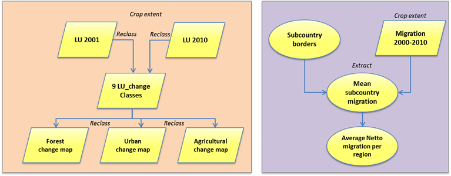

## Introduction

Goals:

- Change maps for land use types Forest,
Agriculture & Urban Land Use
- Mean migration rates per subnational level

Data:

- Modis Land cover (10 km)
- CIESIN migration (1 km)

Extent:

- Whole tropics, this project:  <span style="color:orange; font-family:Georgia; font-size:2em;"> Malaysia </span> 

## Method





## Loading...

We will load and use the following libraries:

- **raster**
- **rgdal**
- **R.utils**
- **caret**
- **e1071**
- **ggplot2**
- **googleVis**
- **rasterVis**
- **ISOcodes**


```{r, echo=FALSE, include=FALSE}

rm(list=ls(all=TRUE))

library(raster)
library(rgdal)
library(R.utils)
library(caret)
library(e1071)
library(ggplot2)
library(googleVis)
library(rasterVis)
library(ISOcodes)


# Load input data into memory
source('R/LoadData.R')
Load_LU(link2001, 2001)
Load_LU(link2010, 2010)


lu_2001 <- raster('data/LC_5min_global_2001.tif')
# names(lu_2001) <- c('LU2001')
lu_2010 <- raster("data/LC_5min_global_2010.tif")
# names(lu_2010) <- c('LU2010')
lu_stack <- stack(lu_2001, lu_2010)
# file.remove('data/LC_5min_global_2010.tif')
# file.remove('data/LC_5min_global_2001.tif')
# if(file.exists('data/LC_5min_global_2010.tif') == TRUE){
#   file.remove('data/LC_5min_global_2010.tif')
# }
# if(file.exists('data/LC_5min_global_2001.tif') == TRUE){
#   file.remove('data/LC_5min_global_2001.tif')
# }

migr <- raster('data/netmigration_2000_2010_1km_crop.tif')

```

## Then we crop to country of choice


...which is today <span style="color:blue; font-family:Georgia; font-size:2em;"> Malaysia </span> 


## Then we...

- Mask Landuse & Migration data to country of choice

  (which is...  <span style="color:red; font-family:Georgia; font-size:2em;"> Malaysia </span>    )

- Resample migration data (1x1 km)
to coarser cell size (10x10 km)

- Simplify 16 Land Use classes to 4 {raster::reclassify}:

    - forest
    
    - other vegetation
    
    - agriculture
    
    - urban

```{r, echo=FALSE, include=FALSE}

Countryname = 'Malaysia'

source('R/MaskingCountry.R')

# Make plots showing the prevalence of the land use types of the country
lu_class <- read.csv("data/lu_classes.csv") # Names
Freq2001 <- as.data.frame(freq(country_lu$LC_5min_global_2001))   # Freq table (unique classes)
Classfreq2001 <- merge(Freq2001, lu_class, by.x = names(Freq2001[1]), by.y = names(lu_class[1])) # Merge 

Freq2010 <- as.data.frame(freq(country_lu$LC_5min_global_2010))   # Freq table (unique classes)
Classfreq2010 <- merge(Freq2010, lu_class, by.x = names(Freq2010[1]), by.y = names(lu_class[1])) # Merge 


## Land use

Freq_both <- merge(Classfreq2001, Classfreq2010, by.x = names(Classfreq2001[1]), by.y = names(Classfreq2010[1]))
Freq_both <- Freq_both[,1:4]
names(Freq_both) <-c("Class", "Count2001", "Name", "Count2010")
Freq_both$difference <- Freq_both$Count2010 - Freq_both$Count2001
Freq_both <- Freq_both[c("Name", "Count2001", "Count2010", "difference")]

# Table showing netto change land use classes
Freq_both

# Reduce to 4 landuse classes
source('R/Simplify.R')

```

## **LAND USE**

## Land use maps after reclassification

```{r, echo=FALSE}
opar <- par(mfrow=c(1,2))
cols = c('darkgreen', 'green', 'orange', 'red')
plot(Countrypoly, bg = "lightblue", main = paste('Landuse', Countryname, "2001", sep = " "), lwd = 1)
plot(LU_Ras_Simple$LU_2001,  add=T, col = cols, legend = FALSE, main = '2001')
legend("bottomright", legend=c("Forest", "Other_Veg", "Agriculture", "Urban"), fill=cols, bg="white", text.font=9, text.width = 6, cex = 0.7)

plot(Countrypoly, bg = "lightblue", main = paste('Landuse', Countryname, "2010", sep = " ") , lwd = 1)
plot(LU_Ras_Simple$LU_2010,  add=T, col = cols, legend = FALSE)
legend("bottomright", legend=c("Forest", "Other_Veg", "Agriculture", "Urban"), fill=cols, bg="white", text.font=9, text.width = 6, cex = 0.7)
par(opar)
```

```{r, echo=FALSE, include=FALSE}
dev.off()
```

## Statistics...

```{r, echo=FALSE}
opar <- par(mfrow=c(1,3))
barplot(LU_Ras_Simple$LU_2001, names.arg = c("Forest", "Other_Veg", "Agriculture", "Urban"), srt=45, cex.names = 0.9, col = c("darkgreen", "green", "orange", "red"), ylab = "Count cells", cex.lab = 2, las=2)
barplot(LU_Ras_Simple$LU_2010, names.arg = c("Forest", "Other_Veg", "Agriculture", "Urban"), srt=45, cex.names = 0.9, col = c("darkgreen", "green", "orange", "red"), las=2)
barplot(Count_dif$netdif, names.arg = c("Forest", "Other_Veg", "Agriculture", "Urban", NA), srt=45, cex.names = 0.9, col = c("darkgreen", "green", "orange", "red", "black"), las=2)
par(opar)
```

```{r, echo=FALSE, include=FALSE}
dev.off()
```


## Confusion matrix (1)

We used the following code:
```{r}
LUasVec_2001 <- as.vector(LU_Ras_Simple$LU_2001)
LUasVec_2010 <- as.vector(LU_Ras_Simple$LU_2010)
CF_mat <- confusionMatrix(LUasVec_2001, LUasVec_2010) 
CF_mat <- CF_mat$table
row.names(CF_mat) <- (c("Forest2001", 'Other veg2001',
                        'Agriculture2001','Urban2001'))
colnames(CF_mat) <- (c('Forest2010', 'Other veg2010',
                       'Agriculture2010','Urban2010'))
```

Which will show the count of cells
for every LU change type

# Confusion matrix (2)

```{r}
CF_mat
```
show the count of cells
for every LU change type

## Land use change

- 16 unique LU change types

- LU2001*10 + LU 2010 -> unique change ID

- reclassify per LU change type -> (Loss, NoChange, Gain)

```{r, eval=FALSE, include=FALSE}
RCL_Forest <- matrix(data = NA, nrow = 16, ncol = 2)
RCL_Forest[,1] <- c(11,12,13,14,21,22,23,24,31,32,33,34,41,42,43,44)
RCL_Forest[,2] <- c(0,-1,-1,-1,1,NA,NA,NA,1,NA,NA,NA,1,NA,NA,NA)
Reclass_Change <- function(reftable){
  reclassify(LU_ChangeClass, reftable)
}
Forest_Change <- Reclass_Change(RCL_Forest)
```

```{r, echo=FALSE, include=FALSE}
# Link data 2001 to 2010 and create 9 unique land use change classes
source('R/ChangeClasses.R')
dev.off()
```

## LU Change (1)

```{r}
PlotChange(Forest_Change)
```

## LU Change (2)

```{r}
PlotChange(Agriculture_Change)
```

## LU Change (3)

```{r}
PlotChange(Urban_Change)
```

## **MIGRATION**

## Statistics...

```{r}
hist(migr_bigcell, col=c('lightblue'), breaks = 50, xlab = 'Mean migration')
```

```{r, echo=FALSE}
# extract mean migration per subnational level
source('R/MigrationSub.R')
```

# We extract mean migration per subnational level...


## A GoogleVis map is created

```{r, eval=FALSE, echo=TRUE}
HTML <- gvisGeoChart(Migr_sub_final_plot,locationvar = "Code",
                     colorvar = "Average Migration", 
                     options=list(region="MY", resolution="provinces", 
                     dataMode='regions'))
```

## Concluding

- Course provided useful tools for this project
- Thanks to R, all our *mistakes* did not cause us having RSI
- Script not completely generic (e.g. GoogleVIS)
    
    
    